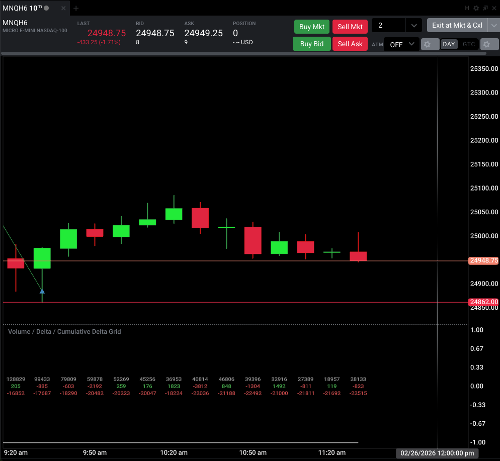
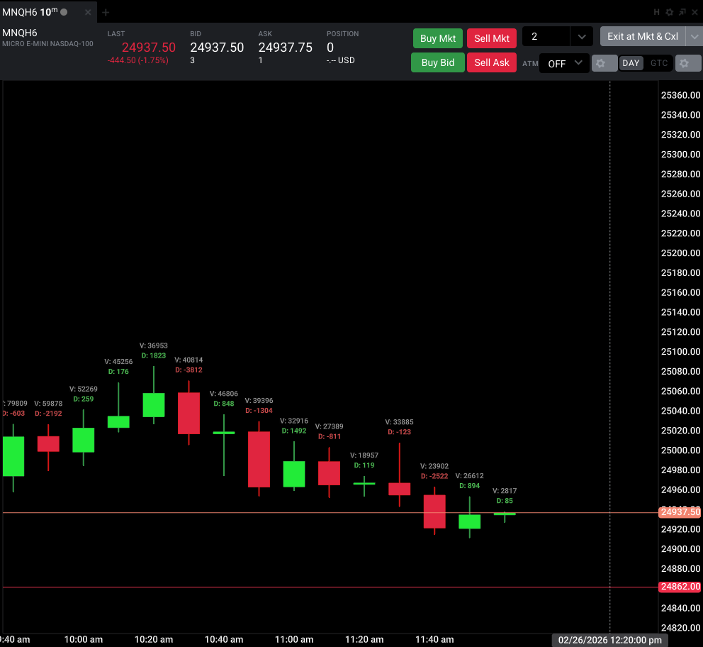

# Tradovate_Indicators
Collection of Tradovate Indicaors

## How to Install
- Clone this repo or download the JS files that you are interested in. Using the Traodvate Trader Web app or Desktop app, add a new code editor to your layout.
- Once added, Click "File" -> "Import"
- Choose the JS file you downloaded or are interested in.
- Save the file.
- On the chart, click "Indicators" and find the Indicator you chose to add to the chart.

## Indicator List
### DeltaGrid.js
**About**

This indicator plots the Volume, Delta and Cumulative Delta for each candle series on the chart. This plots as a sub-plot meaning it does not overlay on the main Candlestick chart. 

### VolumeDeltaCandleInfo.js
**About**

This indicator shows only the Volume and Delta of an individual Candlestick series, however it plots it to the High of each Candle. This is an extension to DeltaGrid.js after seeing a similar implementation in Quantower. Unlike DeltaGrid.js, there are settings to adjust the size of the text as well as adjust the distance above the candle High.

